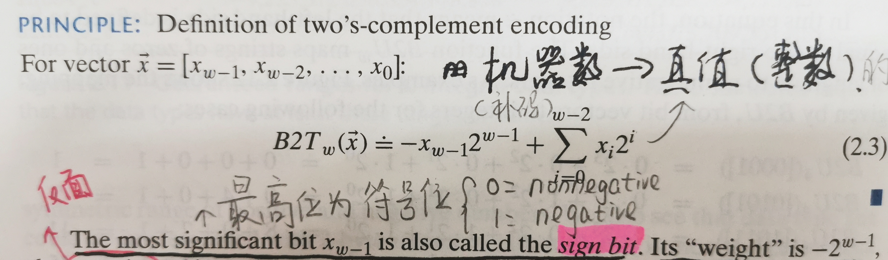

# Two's-Complement Encodings 1

*two's-complement* form is usually expressed as a function *B2Tw*, standing for 
"binary to two's complement", length *w*.



We can easily get some useful conclusions according to the picture above.

For example:
```c
unsigned int a;
int b;

a = 2147483648;
b = (int)a;

printf("a = %u,  b = %d\n", a, b);
```
The output will be `a = 2147483648,  b = -2147483648`.

Because that:
```
2147483648 is (1000 0000 0000 0000 0000 0000 0000 0000)₂, which turns into a signed integer will 
be (-1)*2³¹, whose decimal form is -2147483648.
```
That's Amazing!


